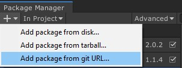

# Muffin Dev for Unity - Multiple Editors

Allows you to create multiple editor extensions for the same target type through code. In the editor, you can use the manager's window to set these custom editor options : enable/disable them, change their order, etc.

## Installation

You can import this package in your Unity project by importing it from the *Package Manager*, or by just downloading it from this repository.

### Import from *Package Manager*

In Unity, go to `Window > Package Manager`. Click on the *Add* button in the top-left corner of the window, and select ***Add package from git URL...***.

Enter the URL to this repository in the taxt field (https://gitlab.com/muffin-dev/unity/standalone/multiple-editors.git), click *Add*, and wait for the package to be installed.

Once installed, you should see the *MultipleEditors* directory appear in your project's `/Packages` directory!

## Demo

Locate the script named `MultipleEditorsDemo.cs` in your project, and uncomment the second line of that script.

This will add custom editor extensions to `GameObject` native inspector, `Transform` and `Rigidbody` components.

You can also change their order and settings from the Multiple Editors Manager window in `Tools > Muffin Dev > Multiple Editors Manager`.

## Documentation

[=> See complete module documentation](./Documentation~/README.md)

## Known issues

The first time you add this plugin and you want to open the *Multiple Editors* window, the window can be empty and you get this error in the Unity Console:

`Instance of MultipleEditorsManagerEditor couldn't be created. The script class needs to derive from ScriptableObject and be placed in the Assets/Editor folder.`

This bug is internal to Unity. You can fix it by just restarting the Editor.

The custom editors for `ModelImporter` and `TexutreImporter` are for the moment disabled because of an unfixed issue. But we're working on it, please be patient! ;)

## Original version

This package is a "standalone" version of [the original *Muffin Dev for Unity* library](https://gitlab.com/muffin-dev/unity), which you can import into your project without getting the [*Muffin Dev's Core Library* ](https://gitlab.com/muffin-dev/unity/open-source/core-library) or any other dependency from the original project. [See the original repository](https://gitlab.com/muffin-dev/unity) to discover some other features of the *Muffin Dev* libraries!

## License

This library uses the [Creative Commons Attribution-ShareAlike 4.0 International license (CC BY-SA 4.0)](https://creativecommons.org/licenses/by-sa/4.0/legalcode).

This means that you can use, share and modify the assets, code and other files as you want (even for commercial projects, but only under the following terms:

- Give an "appropriate credit" (name the authors), and write a link to this package
- If the source package is modified, you must distribute your contibutions under the same license ([CC BY-SA 4.0](https://creativecommons.org/licenses/by-sa/4.0/legalcode))

### Links

- [More "readable" informations about the CC BY-SA 4.0 license](https://creativecommons.org/licenses/by-sa/4.0)
- [Legal CC BY-SA 4.0 license text](https://creativecommons.org/licenses/by-sa/4.0/legalcode)

## Support the project!

Did you find this content useful? The project is open source, but if you want to support my work, please consider buying me a coffee!

