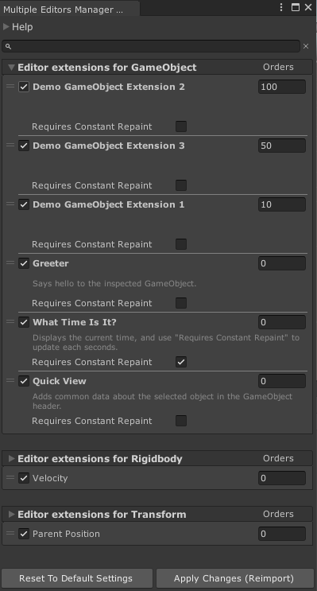

# Muffin Dev for Unity - Multiple Editors

Allows you to create multiple editor extensions for the same target type through code. In the editor, you can use the manager's window to set these custom editor options : enable/disable them, change their order, etc.

## Demo

Locate the script named `MultipleEditorsDemo.cs` in your project, and uncomment the second line of that script.

This will add custom editor extensions to `GameObject` native inspector, `Transform` and `Rigidbody` components.

You can also change their order and settings from the Multiple Editors Manager window in `Tools > Muffin Dev > Multiple Editors Manager`.

## Documentation

[=> See complete module documentation](./Documentation~/README.md)

## Known issues

The first time you add this plugin and you want to open the *Multiple Editors* window, the window can be empty and you get this error in the Unity Console:

`Instance of MultipleEditorsManagerEditor couldn't be created. The script class needs to derive from ScriptableObject and be placed in the Assets/Editor folder.`

This bug is internal to Unity. You can fix it by just restarting the Editor.

The custom editors for `ModelImporter` and `TexutreImporter` are for the moment disabled because of an unfixed issue. But we're working on it, please be patient! ;)